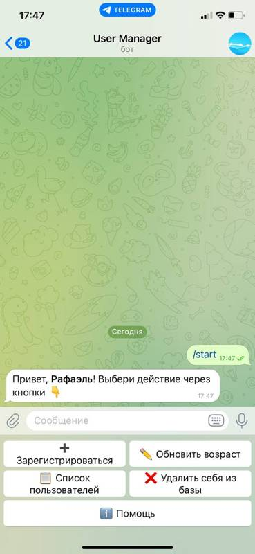
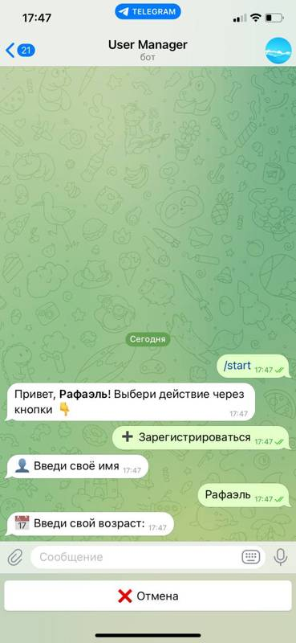
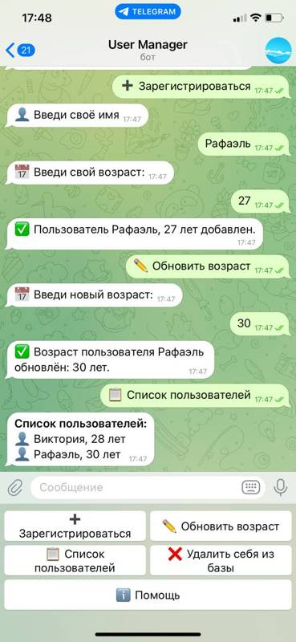

# Telegram Bot — User Manager

Бот для управления списком пользователей через Telegram. Поддерживает регистрацию, просмотр, обновление и удаление данных, 
работает с SQLite и использует `aiogram 3.x` с FSM и логированием.

---

## 🚀 Возможности

- Регистрация пользователя через Telegram
- Список всех зарегистрированных пользователей
- Обновление данных пользователя
- Удаление пользователя
- FSM (машина состояний) для пошагового ввода
- Логирование в файл
- Хранение данных в SQLite

---

## 🛠️ Технологии

- Python 3.10+
- aiogram 3.x
- SQLite
- FSM (aiogram.fsm)
- Logging (в файл)
- [python-dotenv](https://pypi.org/project/python-dotenv/) для загрузки конфигурации

---

## 📦 Установка и запуск

1. Клонируйте репозиторий:

```bash
git clone https://github.com/your-username/your-repo.git
cd your-repo
```

2. Создайте виртуальное окружение и активируйте его:

```bash
python -m venv venv
# Для Windows:
venv\Scripts\activate
# Для Unix/Mac:
source venv/bin/activate
```
3. Установите зависимости:

```bash
pip install -r requirements.txt
```

4. Создайте .env файл в корне проекта со следующим содержанием:

```bash
BOT_TOKEN=ваш_токен_бота
```
5. Запустите бота:

```bash
python main.py
```

---

## 📁 Структура проекта

```bash
.
├── handlers/         # Хендлеры для команд и состояний
├── database/         # Работа с SQLite
├── states/           # Определение FSM состояний
├── middlewares/      # собственные миддлвары
├── logs/             # Лог-файлы
├── main.py           # Точка входа
├── config.py         # Загрузка переменных окружения
├── requirements.txt
└── README.md
```

---

## 📝 Пример использования:

/start — начать работу с ботом

/add — зарегистрироваться

/list — посмотреть всех пользователей

/update — обновить свои данные

/delete — удалить себя из базы

/help — краткое описание и список доступных команд.


---
## 📸 Скриншоты
| Главное меню | Добавление пользователя | Обновление и список |
|--------------|--------------------------|----------------------|
|  |  |  |

## 👤 Автор
Рафаэль Хакимов.

Если вам понравился проект, поставьте ⭐ на GitHub!